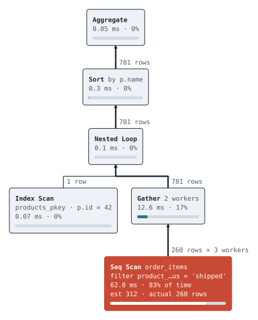
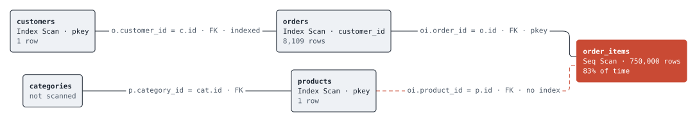

# diagram

A measurement-first layout engine for node and edge diagrams, in Go.

The rule that makes it different from drawing boxes by hand: **layout never
runs before measurement**. Every label is measured with real font metrics,
each node is sized from its label, and only then are nodes positioned. A label
cannot overrun its box because the box was made for it. Text that must not
exceed a width is shortened with a middle ellipsis (identifiers are usually
recognisable from both ends) or wrapped, and the full text is kept in the
output for tooltips.

The engine returns geometry, not pictures. Rendering is a separate step, so
the same layout can become a standalone SVG file, an SVG fragment using a
page's CSS variables, or an interactive component in a web app.

```
diagram         core types: Graph, Node, Edge, Line, Layout
text            font measurement (Go fonts embedded; any TTF/OTF can be added),
                middle ellipsis, wrapping
layout/tree     tidy tree layout (Buchheim, Junger and Leipert) for nodes of
                any size, with edge labels that never collide with sibling edges
layout/layered  layered layout for general directed graphs (Sugiyama): cycles
                broken by reversing back edges, longest-path ranking, dummy
                nodes for long edges, labels on their own interleaved ranks,
                barycenter crossing reduction with adjacent swaps, relaxed
                coordinate assignment, curved routing, self loops
spec            JSON graph description shared by the CLI and other languages
render/svg      SVG renderer with themes: literal colours or CSS custom properties
layoutjson      render-ready geometry as JSON (every coordinate absolute and rounded)
web/diagram.js  browser renderer: the same SVG from that JSON, plus hover and selection
cmd/diagram     CLI: JSON in, SVG or layout JSON out

Both layouts support all four directions: top-down, bottom-up, left-to-right
and right-to-left. Layouts work in an abstract (cross, rank) frame and
`diagram.Frame` maps the result, so a direction is a coordinate mapping
rather than a second code path.
```

## Example

```go
m := text.NewGoFonts()
opts := diagram.Options{Measurer: m, Styles: text.DefaultStyles()}
share := 0.83
g := &diagram.Graph{
    Nodes: []*diagram.Node{
        {ID: "nl", Lines: []diagram.Line{diagram.L("title", "Nested Loop")}},
        {ID: "seq", Kind: "hot", Bar: &share, MaxWidth: 220, Overflow: diagram.Ellipsize,
            Lines: []diagram.Line{
                {{Text: "Seq Scan ", Style: "title"}, {Text: "order_items", Style: "detail"}},
                diagram.L("detail", "filter product_id = 42"),
            }},
    },
    Edges: []*diagram.Edge{{From: "nl", To: "seq", Label: "781 rows", Weight: 0.5, Arrow: diagram.ArrowBackward}},
}
l, err := tree.Layout(g, opts)
out := svg.Render(l, svg.Options{Theme: svg.Default(), Styles: opts.Styles, Title: "Plan tree"})
```

Or from the command line:

```sh
go run github.com/daniel-widrick/diagram/cmd/diagram@latest -title "Plan tree" < testdata/plan.json > plan.svg
go run github.com/daniel-widrick/diagram/cmd/diagram@latest -layout layered < testdata/join.json > join.svg
```





## In the browser

`diagram -format json` writes the layout as render-ready geometry, and
`web/diagram.js` (an ES module with no dependencies or build step) turns it
into SVG in the page:

```js
import { mount } from './diagram.js'
const view = mount(document.querySelector('#host'), doc, {
  theme: 'tokens',                       // or 'default', or your own theme object
  onSelect: (id, node) => showDetails(node),
})
view.select('orders')                    // programmatic selection; Escape clears
```

Nodes get a `hover` class under the pointer and `selected` when clicked;
style them from your page's CSS. `toSVG(doc, options)` returns the SVG text
without mounting. The text it produces is identical to the Go renderer's,
which `node web/test.mjs` checks for every example in `testdata`.

## Fonts

Measurement and rendering must agree on the font. The default measurer
embeds the Go fonts (Go Mono and Go Regular, with bold weights) so nothing
needs installing; the default theme's font stacks lead with them. To use
another font, register its TTF or OTF data with `FontMeasurer.AddFont` and
put the same family first in the theme's font stack. A node whose label was
measured elsewhere, for example in a browser with `measureText`, can pass
its size in `Node.Size` and skips measurement.

## Features shared by both layouts

- **Ports.** Edges leave and enter a node at spread points along its side,
  ordered so they never cross at the border.
- **Routing.** Layered edges turn only in the bands between layers, on
  separate tracks when they would overlap, so they never pass through a
  node or another edge's label. `Routing` picks rounded (default) or sharp
  corners; rounding stays inside the same corridor.
- **Collapse.** `Node.Collapsed` hides a subtree (or, in a layered graph,
  everything reachable only through the node); the node shows a +N badge and
  `Layout.HiddenNodes` lists what was left out.
- **Groups.** `Graph.Groups` and `Node.Group` draw a labelled box around a
  set of nodes. Boxes contain exactly their members, never overlap outsiders
  or each other, and edges between members stay inside. In trees a group
  that cuts through a subtree overrides parent centring.

## Testing

Every layout is checked against invariants on random inputs in all four
directions: nodes never overlap and stay inside the drawing, every line fits
its node, edge endpoints sit on node borders, labels stay inside the drawing
and clear of every node and of each other, tree parents are centred over
their children, and layered edges run forward along the rank axis unless
they were reversed to break a cycle. Golden SVG files cover the renderer.

## Status

Tree and layered layouts are complete. Planned: ports so edges leave a node
from spread points rather than its centre, orthogonal edge routing as an
option for layered graphs, a web component renderer, and Brandes-Köpf
coordinate assignment for straighter long edges.

Built first for [pginspect](https://github.com/daniel-widrick/pginspect),
where it draws query plan trees.
